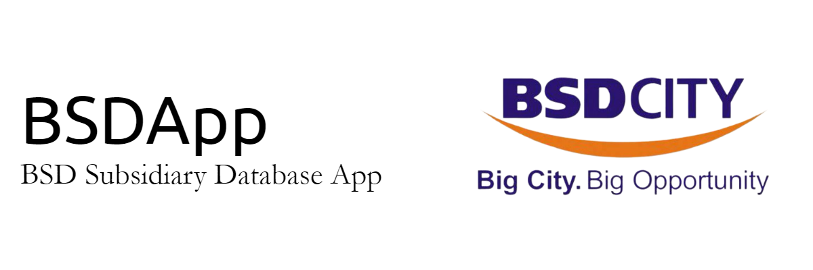

## About

BSDApp or BSD Subsidiary Database App is an application released on 2024 to manage database of subsidiaries under PT Bumi Serpong Damai Tbk. Authorized users of this app will be able to fully use the feature provided here, including:

1. **Show subsidiaries data**: Displays the entire list of current subsidiaries and their properties, ranging from registered company name up to total assets value invested.
2. **Add subsidiaries data**: Helps in registering new subsidiaries and adding their informations to BSD Subsidiaries Database.
3. **Modify subsidiaries data**: Provides options to modify selected values from and into Database (*Currently limited to changing Ownership, Status, and Total Assets values*).
4. **Remove subsidiaries data**: Deletes the selected subsidiaries data entirely from Subsidiaries Database.

## Installation

Users can clone this program by running the following code:

    git clone git@github.com:garudapaksi-yusuf/BSDApp.git

    
## Project Organization

The directory structure of BSDApp project is shown below:

    ├── README.md          <- Top-level README for developers using this project.
    │
    ├── data               <- Up-to-date PT Bumi Serpong Damai Tbk Subsidiaries Database.
    │
    ├── docs               <- Images and presentations used for this project.
    │
    ├── src                <- Source code for BSDApp.
    │
    └── requirements.txt   <- Module requirements for reproducing the program environment;
                              generated with pipreqs > requirements.txt

